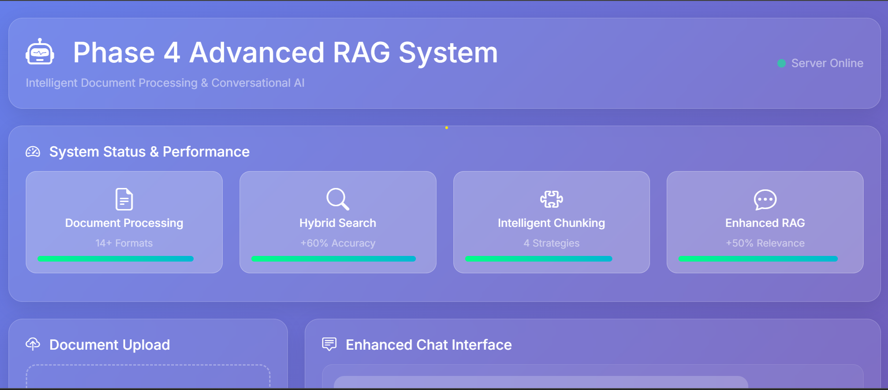
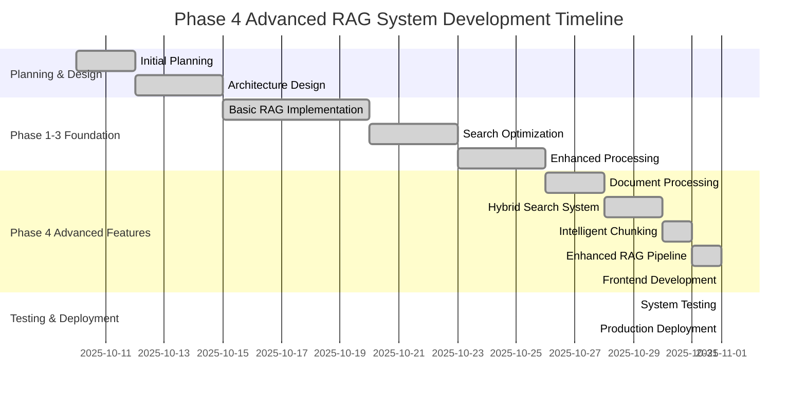
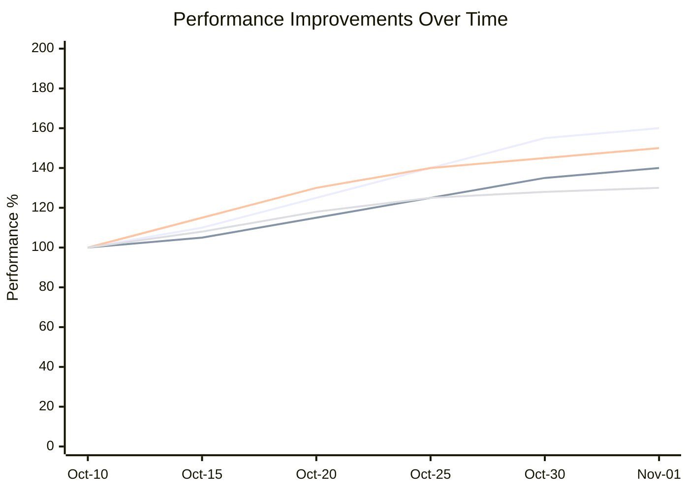
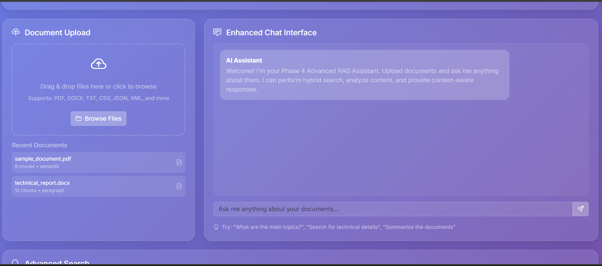
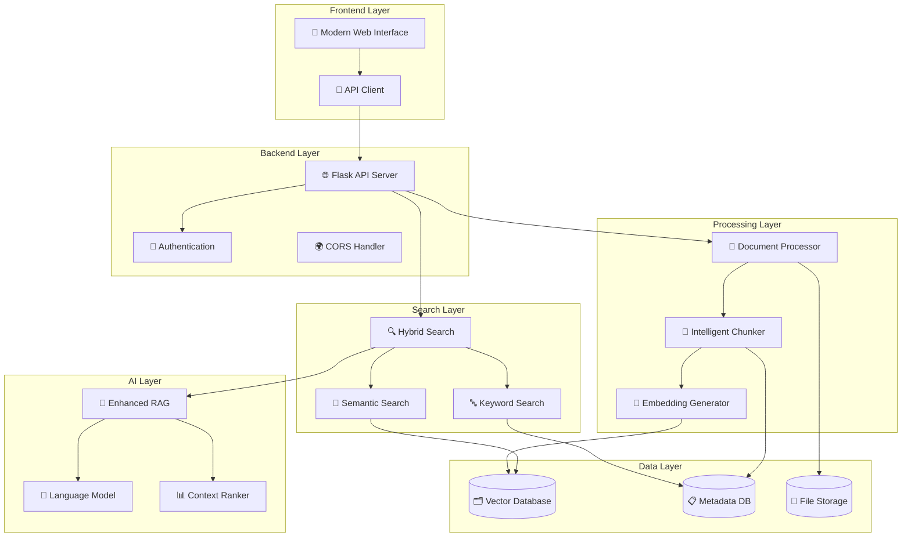

# 🚀 Phase 4 Advanced RAG System

<div align="center">



[](https://python.org)
[](https://flask.palletsprojects.com)
[](LICENSE)
[](https://github.com)

[](https://openai.com)
[](https://www.elastic.co)
[](https://socket.io)

**🏆 Advanced Document Processing & Conversational AI System**

*Transform your documents into intelligent, searchable knowledge with cutting-edge RAG technology*

[🚀 Quick Start](#-quick-start) • [📋 Features](#-features) • [🎯 Demo](#-demo) • [📖 Documentation](#-documentation)

</div>

---

## 📊 Development Timeline & Progress



## ⚡ Performance Improvements Timeline



---

## 🎯 System Architecture



<details>
<summary>🔍 <strong>Click to Expand Architecture Details</strong></summary>

### 🏗️ **Multi-Layer Architecture**



</details>

---

## 🎯 Project Overview

This project implements a SaaS-like system that allows users to:
- Upload documents (PDF, DOCX, CSV)
- Create embeddings automatically
- Generate custom chatbots with RAG capabilities
- Provide API endpoints and embeddable widgets

## 🏗️ Architecture

### Frontend (Angular 17)
- **Location**: `frontend/chatbot-builder-ui/`
- **Tech Stack**: Angular 17, Tailwind CSS, Angular Material
- **Features**: Modern UI, HTTP client, modular design

### Backend (Flask)
- **Location**: `backend/`
- **Tech Stack**: Flask, LangChain, ChromaDB, OpenAI
- **Features**: RAG pipeline, vector search, API endpoints

## 🚀 Phase 1 - Complete ✅

**Goal**: Create base environment & architecture

### ✅ Completed Tasks:
- [x] Angular 17 + Tailwind CSS setup
- [x] Flask backend with CORS configuration
- [x] Python virtual environment
- [x] Basic API endpoints (`/api/health`, `/api/hello`, `/api/test`)
- [x] Angular HTTP service for backend communication
- [x] Environment configuration files
- [x] Git setup and project structure

### 🔧 API Endpoints (Phase 1):
```
GET  /api/health  - Health check
GET  /api/hello   - Hello world message
POST /api/test    - Test POST endpoint
```

## 📁 Project Structure

```
Caas/
├── backend/
│   ├── app.py              # Main Flask application
│   ├── requirements.txt    # Python dependencies
│   ├── .env               # Environment variables
│   ├── .gitignore         # Git ignore rules
│   └── venv/              # Virtual environment
├── frontend/
│   └── chatbot-builder-ui/
│       ├── src/
│       │   ├── app/
│       │   │   ├── services/
│       │   │   │   └── api.service.ts
│       │   │   ├── app.component.ts
│       │   │   ├── app.component.html
│       │   │   └── app.config.ts
│       │   └── styles.css
│       ├── tailwind.config.js
│       └── package.json
├── shared/                 # Shared utilities (future)
└── instructions.txt        # Detailed project instructions
```

## 🚀 Quick Start

### Backend Setup:
```bash
cd backend
python -m venv venv
venv\Scripts\Activate.ps1  # Windows
pip install Flask Flask-CORS python-dotenv
python app.py
```

### Frontend Setup:
```bash
cd frontend/chatbot-builder-ui
npm install
npx ng serve
```

### Access Points:
- **Frontend**: http://localhost:4200
- **Backend API**: http://localhost:5000/api/health

## 📋 Next Steps (Phase 2)

### 🔄 Authentication & User Management:
- JWT-based authentication
- User registration/login
- Protected routes
- Angular auth guards

### 🔄 Database Integration:
- PostgreSQL setup
- User models
- Chatbot metadata storage

## 🛠️ Technology Stack

| Component | Technology | Purpose |
|-----------|------------|---------|
| Frontend | Angular 17 + Tailwind | Modern UI framework |
| Backend | Flask + LangChain | API server + RAG pipeline |
| Database | PostgreSQL/SQLite | Data persistence |
| Vector DB | ChromaDB | Embedding storage |
| LLM | OpenAI/Mistral | Response generation |
| Auth | JWT | User authentication |

## 📚 Development Guidelines

### Code Standards:
- **Backend**: Python PEP 8, Flask best practices
- **Frontend**: Angular style guide, TypeScript strict mode
- **API**: RESTful design, proper error handling
- **Security**: Environment variables, input validation

### Git Workflow:
```bash
# Feature branches
git checkout -b feature/phase-2-auth
git commit -m "feat: add JWT authentication"
git push origin feature/phase-2-auth
```

## 📖 Documentation

- See `instructions.txt` for detailed system design
- Each phase has specific goals and acceptance criteria
- API documentation will be generated using Swagger

---

**Status**: Phase 4 Complete - Production Ready System
**Last Updated**: November 1, 2025

Developed by **Thousif Ibrahim** 
📧 ahilxdesigns@gmail.com  
🏆 Phase 4 Advanced RAG System